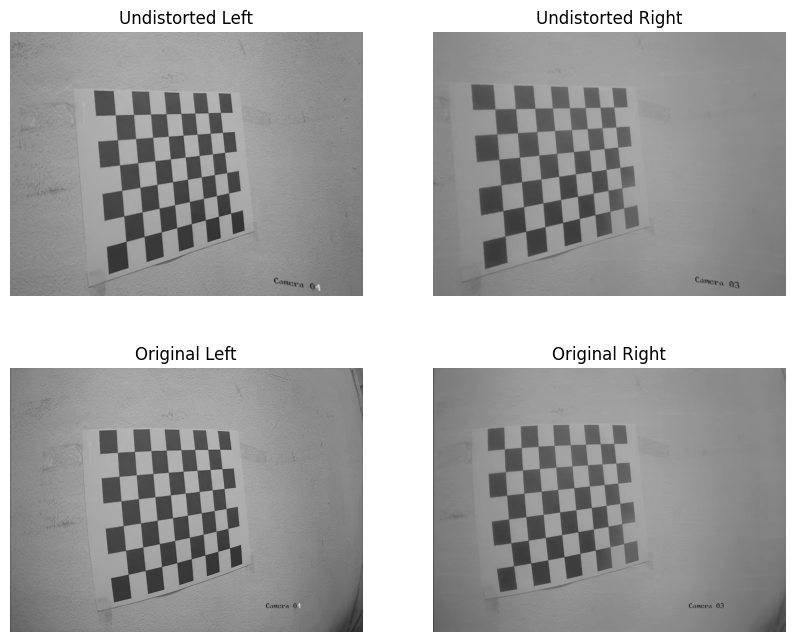

# Panorama Stitcher

This project performs stereo camera calibration and panorama stitching using OpenCV. The goal is to accurately estimate the intrinsic and extrinsic parameters of the stereo camera setup, enabling the creation of seamless panoramic images.

## Project Structure

- **Images**
  - **Example**
    - `a single stereo image after calibration.png` 
  - **Result**
    - `Output.png` 
  - **stereoLeft**
    - Contains the left images for stereo calibration
  - **stereoRight**
    - Contains the right images for stereo calibration
- **Notebook**
  - `Stereo Calibration.ipynb` - Jupyter notebook containing the stereo calibration process

## Example Image After Calibration

## Resulting Panorama Output

## Requirements

- Python 3.x
- OpenCV
- NumPy
- Jupyter Notebook